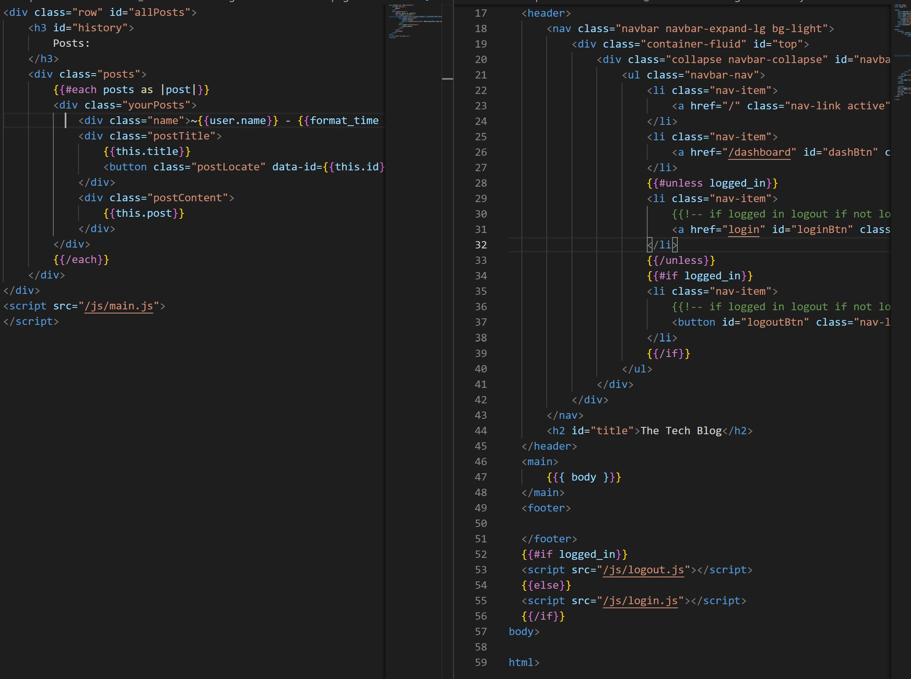
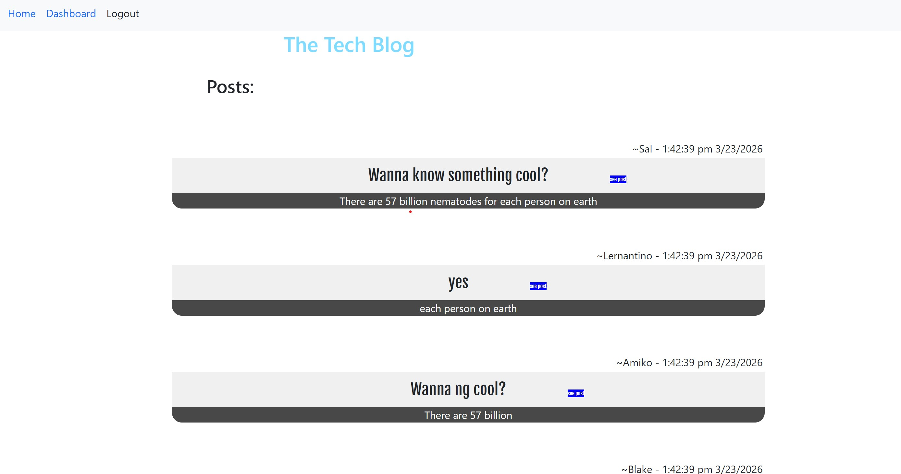

# The Tech Blog

## Description

this project uses sequelize and handlebars to create a webpage useful for posting commenting on tech like things. There are template handlebars used as well as partials to help include DRY code and login, logout and signups which are neccessary to perform certain functionalities

## Table Of Contents

- [Installation](##Installation)
- [Usage](##Usage)
- [License](##License)
- [Contributing](##Contributing)
- [Tests](##Tests)
- [Questions](##Questions)

## Installation

When a user comes to the site for the first time, they have access to the main page where they can view all posts but cannot see their own posts of make comments. When they naviagte away from the homepage, they are taken to a login screen which has options of a sign up link. Once signed in, the user can make their own posts or comments, see other peoples posts and comment on them and delete their own posts

## Usage

the above image shows an exmaple of the code used for the handlebars and how the template is set up saving a lot of code.

Below is an exmaple of how these two peices of code appear

## License

This project is covered under the MIT License

## Contributing

[bencyna](https://github.com/bencyna/)

## Tests

go to

## Questions

If you have any questions about this project, you can veiw my github account at https://github.com/bencyna or email me at benjamincyna@gmail.com
